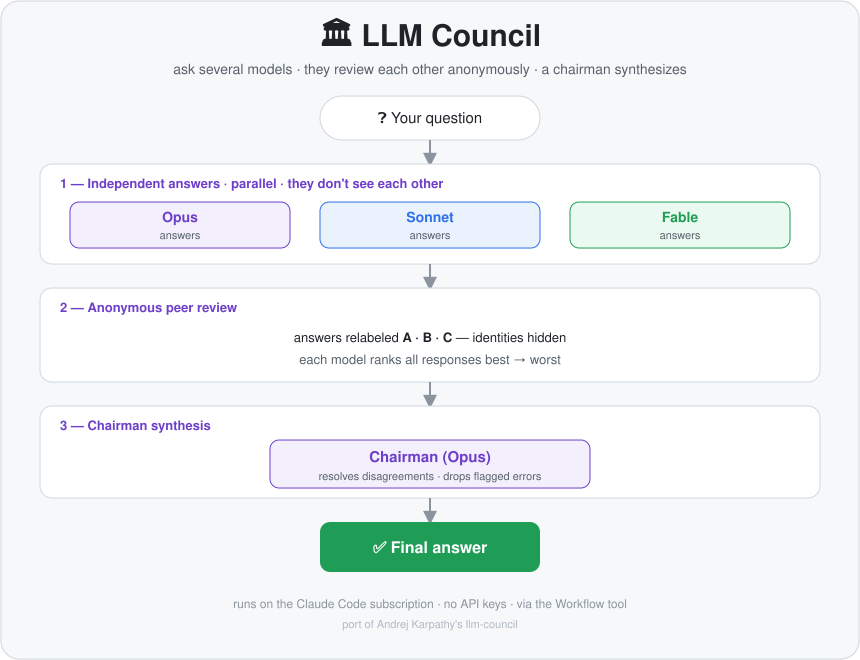

# 🏛 LLM Council — a Claude Code skill

*[Русская версия →](README.ru.md)*

Ask a question once, and let **several models answer it independently, anonymously review each other, and have a "Chairman" model synthesize the single best answer.**

A port of Andrej Karpathy's [`llm-council`](https://github.com/karpathy/llm-council) — but it runs entirely **inside Claude Code on your subscription**. No OpenRouter, no API keys, no extra cost: the council members are different Claude model tiers (Opus, Sonnet, Fable).

<p align="center">
  
</p>

## How it works

Three stages, run by the Claude Code **Workflow** tool:

1. **Independent answers.** Each council member (`opus`, `sonnet`, `fable`) answers the question on its own, in parallel. They don't see each other's work.
2. **Anonymous peer review.** The answers are relabeled `Response A / B / C` — identities hidden — and each model ranks them best→worst and flags factual errors. Anonymity keeps the ranking honest.
3. **Chairman synthesis.** The Chairman (`opus`) reads every answer and every review, resolves disagreements, drops claims flagged as wrong, and writes one final answer.

You get the **final answer** plus a short **council summary** (the aggregate ranking and any notable disagreement).

## Install

Copy the skill folder into your personal Claude Code skills directory:

```bash
git clone https://github.com/selajuf/llm-council-skill.git
cp -r llm-council-skill/llm-council ~/.claude/skills/llm-council
```

It's now available in every project.

## Use

```
/llm-council How should I price a B2B SaaS for the EU market?
```

…or just say *"ask the council"*, *"give me an ensemble answer"*, *"have several models review this"*. The skill description triggers on those.

**Don't** use it for routine questions — a council spawns `2N+1` agents and burns tokens. It's for high-stakes, ambiguous, or contested answers where one model isn't enough.

## Requirements

- **Claude Code** with access to multiple model tiers (Opus / Sonnet / Fable).
- The **`Workflow`** tool (multi-agent orchestration). The skill uses it as the execution engine — see the note below on why.

## Why Workflow, not raw subagents

In heavily-loaded setups (many SessionStart hooks injecting context into every subagent), a raw `Agent` dispatch with a non-`opus` model can drift into chat mode and **idle** — replying *"ready, what would you like?"* instead of answering. Workflow subagents are told *"your final text is the return value"*, so they answer reliably. That's why the council is orchestrated as a Workflow script ([`llm-council/run.js`](llm-council/run.js)) rather than parallel `Agent` calls.

## Customize

- Edit the roster / chairman in [`llm-council/run.js`](llm-council/run.js) (`MEMBERS`, the `chairman` model).
- `haiku` is intentionally left out — too weak as an autonomous member.
- Want loop-until-consensus or external models (GPT/Gemini)? Extend the Workflow script.

## Credit & License

Concept by [Andrej Karpathy](https://github.com/karpathy/llm-council). This is an independent Claude Code port. MIT — see [LICENSE](LICENSE).
